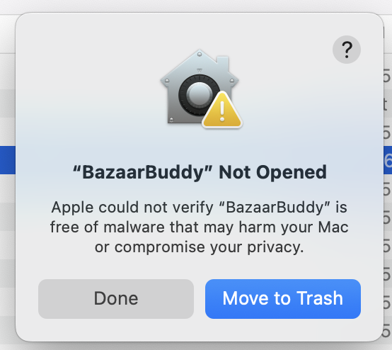
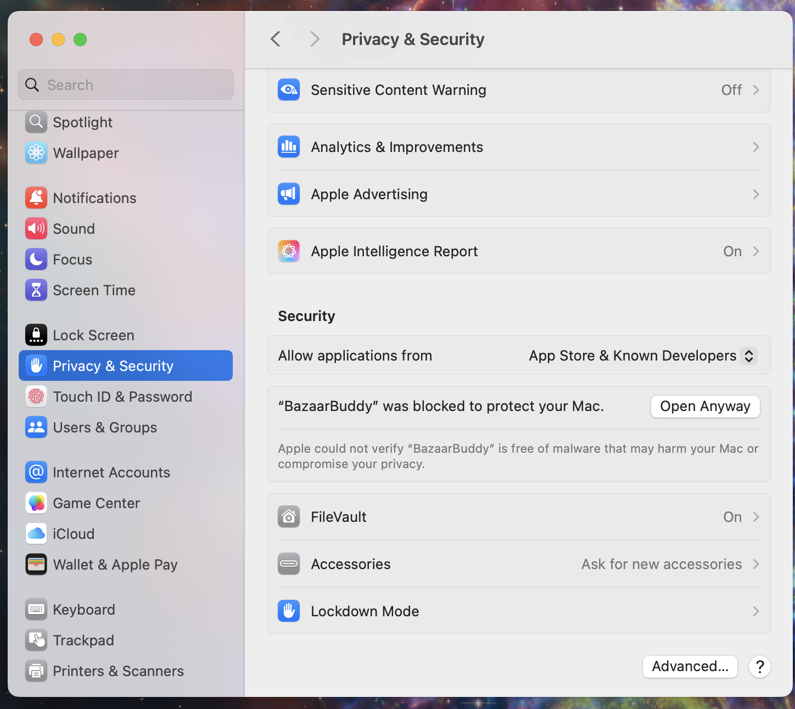
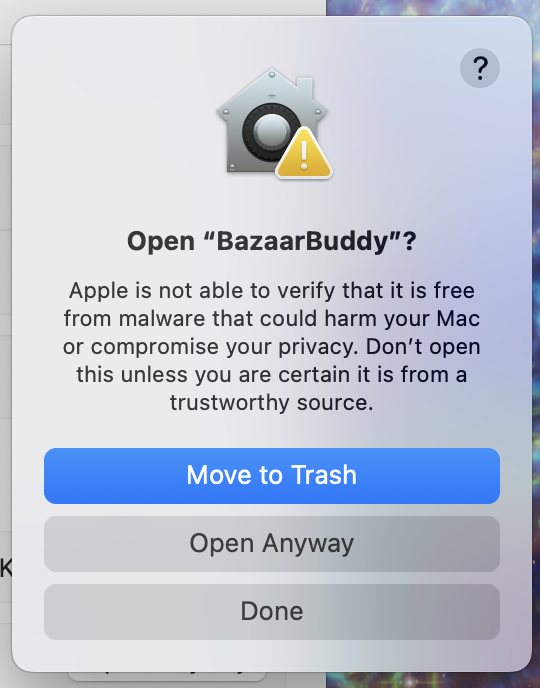
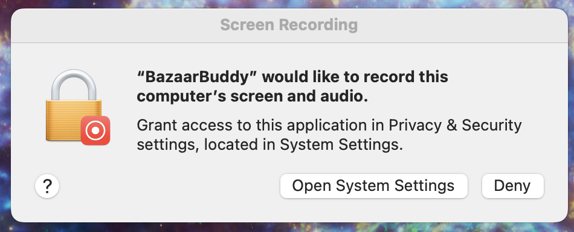
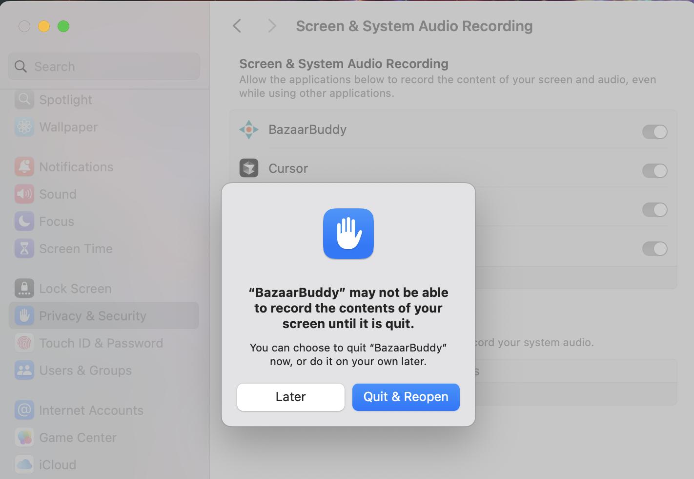

# Mac Installation Guide

> **Note:** This application is only compatible with Apple Silicon Macs. It does not support Intel Macs due to the tesseract-ocr library being compiled specifically for Apple Silicon.

## Installation Steps

1. Download the latest release from our [releases page](https://github.com/stonehenge-collective/bazaar-buddy-client/releases)
2. Extract the downloaded ZIP file
3. Drag the Bazaar Buddy app to your Applications folder

## First Run Setup

### Security Permissions

Since we're currently an unsigned application, you'll need to grant some permissions:

1. When you first launch Bazaar Buddy, you'll see a security warning:
   

   Click "Done"

2. Open System Preferences > Security & Privacy and scroll down to the bottom.
   

   Click "Open Anyway" next to Bazaar Buddy

3. Confirm the developer warning:
   

   
   Click "Open Anyway"

### Screen Recording Permission

Bazaar Buddy needs screen recording access to capture The Bazaar window:

1. When prompted, click "Open System Settings"
   

2. Enable screen recording for Bazaar Buddy
   

3. Restart Bazaar Buddy when prompted

## Usage

Once all permissions are granted:

1. Start Bazaar Buddy
2. Launch The Bazaar game
3. The application will automatically detect The Bazaar window and begin capturing
